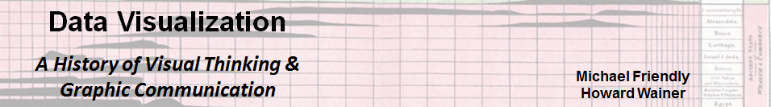

<!-- banner here -->


<div class="contents">
<h1 class="tocpage">Chapter 1: In the Beginning ...</h1>
<hr class="tocpage">

<!-- chapter quote -->
> *If you would understand anything, observe its beginning and its development.*
>
> Aristotle

<!-- load R scripts -->
```{r include=FALSE}
knitr::opts_chunk$set(fig.path='fig/',
                      echo=FALSE, warning=FALSE, message=FALSE)
```
```{r, echo=FALSE}
source("R/chfigs.R")
```


<div class="row">
  <div class="col-md-6">
    <!-- prelude-inserted  -->
    <div class="chapterprelude">
    <h3>Synopsis</h3>
    <!-- insert prelude here -->
    This chapter is an overview of the larger questions and themes that
    provide a context for the book. We consider the relations among numerical data, evidence for an argument 
    and graphs,
    and then describe some of the pre-history of the visual representation of numbers and the early rise of 
    visualization itself. The story continues to the rise of empirical thinking in philosophy and
    science around the 16th Century and the concomitant
    remarkable development of the visual representation of numbers to communicate quantitative phenomena.
    </div>

  </div>

  <div class="col-md-6">
    <h3>Contents</h3>
    <!-- insert minitoc here -->
    <dl class="chaptoc">
      <dd>1.1. Data, evidence and graphs</dd>
      <dd>1.2. Words, numbers and pictures</dd>
      <dd>1.3. Seeing the unexpected</dd>
      <dd>1.4. The Rise of the Graphic Method and Visual Thinking</dd>
      <dd>1.5. A Golden Age</dd>
      <dd>1.6. Learning more</dd>
    </dl>

  </div>
</div>

<!-- more-content -->
### More information

[Chapter 1](pdf/TOGS-Ch1.pdf) in the draft PDF version is available for free download.

### Chapter figures

```{r chfigs1,results='asis'}
do_chapter(1)
```


</div> <!--end contents -->


