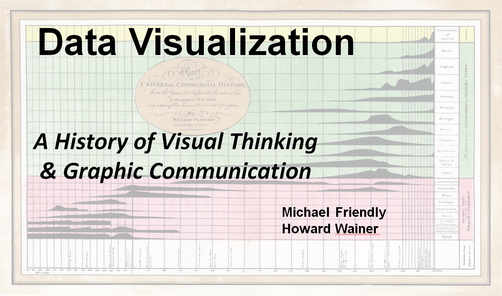

```{r out.width="100%", echo=FALSE, eval=TRUE}

```

### Cover image {-}
The front cover shows the main image from William Playfair's (1805)
*Chart of Universal Commercial History*. In it, he asks: 
How and when did civilizations rise and fall from 1500 BCE to 1800 AD?
He shows ancient and modern civilizations in the form of small graphs
over time, representing some indication of strength of an empire
or civilization, in a way that then can be visually compared to
ask further questions: Why were some so long-lived? When and
why did some of them fail?
Another implicit question is how to visualize a history
and tell its story.

This graph uses what at the time was a novel graphic form
of small little distributions showing the relative strength
of each civilization over time. It was recently re-invented
and called a ``ridgeline'' plot because it resembles a set of
mountain ridges. See further discussion of this graph shown
as Figure~\ref{fig:playfair1805-inquiry}.  

# Aims {-}

These pages are an initial sketch of a web site to accompany our forthcoming book to be published by Harvard University Press.
We try to provide an overview of the book, and include some color images and text that does not appear in the printed edition.

This book aims to give a comprehensive history of data visualization with an emphasis on these questions:

* How did the graphic depictions of numbers arise? 
* More importantly, **why**?
    - What factors led to the key innovations in graphs and diagrams that are commonplace today? 
    - How did graphic inventions make a difference in understanding natural and social phenomena and communicating results?

